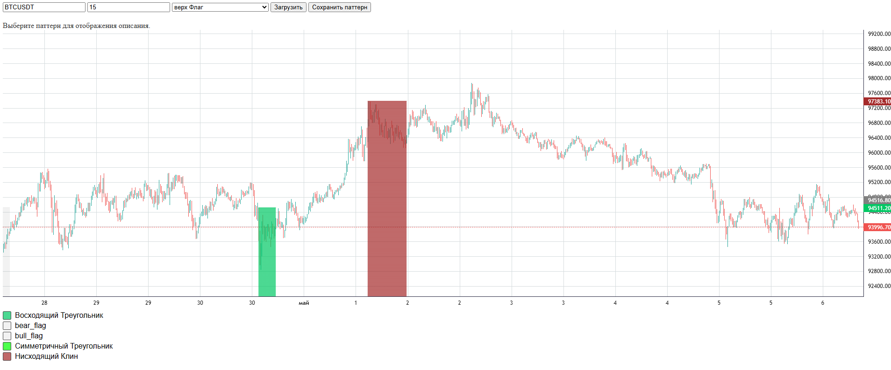

## Описание
Проба пера. 
Загружает исторические данные монет. Есть возможность ручной разметки паттернов. Есть возможность автоматически создавать паттерны включая их в копию исторических данных по монете с пометкой (_auto), автоматически созданные патерны размечаются в БД. И сама модель для определениия паттерна.

## Установка (Windows)
1. Клонирование репозитория 

```git clone https://github.com/StemPank/nn_patterns_analysis.git```

2. Создание виртуального окружения

```py -m venv venv```

3. Активация виртуального окружения

```.\venv\Scripts\activate```

4. Переход в директорию fisher

```cd nn_patterns_analysis```

5. Установка зависимостей

```py -m pip install -r requirements.txt```
<!-- py -m pip freeze > requirements.txt -->

## Инструкции 
Для загрузки исторических данных в файле main.py нужно закоментировать все кроме: 
```python
for syimbol in listing:
    Agent().historical_data(syimbol, 15)
    inject_patterns_into_historical_data(symbol = syimbol, interval='15')
```
В БД запишутся исторические данные по монетам (лучше началь с обной, двух), inject_patterns_into_historical_data дублирует данные по монете но с пометкой (_ayto), автоматически заменяет часть данных на паттерны (выберает длинну, строит линии паттерна и рандомно назначает цены закрвтия в этих приделах, затем рабечаеи остальные данные свечи), и размечает их.

Для автоматической разметки нужно запустить файл gui.py, по ссылке в терминале откроется окно для разметки. 

нужно вебрать точку времени старта, затем конча паттерна, его название и сохранить (для отображения уже размеченых паттернов обновите). Если хотите посмотреть автоматически размеченные паттерны, введите имя монеты с подписью (_ayto) и загрузите.

Cтек данных для обучения формируется в файле db_pattern_detection_app.py. Фрагменты без паттерна берутся из пустых участков.

Для обучения и тестирования модели закоментируйте в файле main.py все и оставте:
```python
sample_window = database.fetch_historical_data("BTCUSDT", 15) # Данные для теста

recognizer = PatternRecognizer(interval=15) # Инициализация, модель чуствительна к интервалу
recognizer.prepare_dataset() # Подготовка датасета для обучения
recognizer.train_model() # Обучение модели

i_test = len(sample_window)-120 # Индекс для теста, 120 свечей от конца (120 свечей матрица для обучения модели) 

result = recognizer.predict_verbose(sample_window[i_test:])
for label, prob in result:
    print(f"{label}: {prob * 100:.2f}%")
```
Ответ тестирования модели должен быть примерно такой:
```python
ascending_triangle: 15.71%
bear_flag: 14.32%
descending_triangle: 13.99%
bull_flag: 13.52%
ascending_wedge: 12.53%
symmetric_triangle: 11.95%
descending_wedge: 10.02%
none: 7.97%
```

Остальные коментарии в коде
